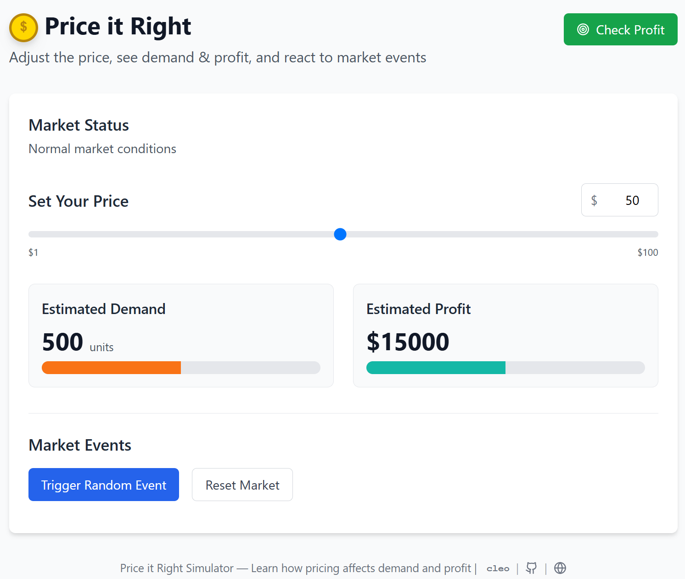

# 💸 Price It Right – Business Simulator

An interactive **pricing + demand simulator** built with React Typescript + Vite.  
Users adjust the price of a product to visualize demand, revenue, and profit in real-time — complete with **market twist events** like a crash, new competition, or viral trend.


🔗 Live Demo: [https://priceprofit.cleof.us](https://priceprofit.pages.dev)

---

## 🎯 Features

- 📊 Dynamic demand curve visualization with [Chart.js](https://www.chartjs.org/)
- 💰 Real-time calculation of:
  - **Profit** = (Price - Cost) × Demand
  - **Revenue** = Price × Demand
- 🔀 Random market events (simulate a crash, new competitor, etc.)
- 🎛️ Responsive slider UI for live price control
- 🔥 Fully responsive and mobile-ready

---

## 🧠 Core Business Concepts

This project helps demonstrate:

| Concept                | Description |
|------------------------|-------------|
| **Supply & Demand**    | Inverse relationship shown visually |
| **Price Elasticity**   | See how demand shifts with price changes |
| **Profit Optimization**| Maximize profit, not just sales |
| **Market Forces**      | See how external shocks affect demand |

Connected to lessons:  
*Pricing, Supply & Demand, Game Theory, Econ Strategy @ Business & Econ Tesla STEM High School*

---

## 🛠 Tech Stack

| Tool                 | Purpose                          |
|----------------------|----------------------------------|
| [React 18](https://reactjs.org/)     | UI Framework                     |
| [Vite](https://vitejs.dev/)          | Build tool / Dev server          |
| [TypeScript](https://www.typescriptlang.org/) | Type safety                     |
| [Chart.js](https://www.chartjs.org/) + [react-chartjs-2](https://react-chartjs-2.js.org/) | Graph rendering |
| [Tailwind CSS](https://tailwindcss.com/)  | Styling / Layout                 |
| [Lucide-react](https://lucide.dev/)         | Icons                            |

---

## 🚀 Local Development

```bash
# 1. Install dependencies
npm install

# 2. Start dev server
npm run dev

# 3. Visit localhost
http://localhost:5173
